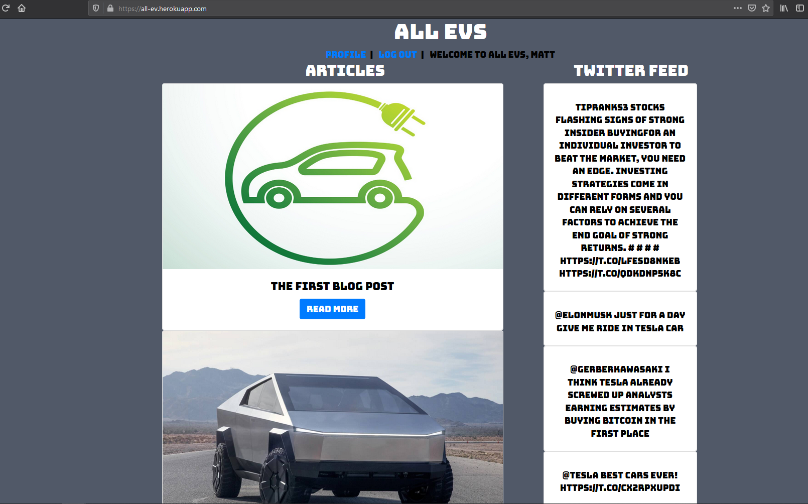

# All EVs Blog

### Technologies Used:
* MongoDB
* Express 
* React 
* Node.JS 
* Google Fonts 
* Bootstrap 
* Twitter API

#### Getting Started:
View my app on Heroku here: https://all-ev.herokuapp.com/

Trello Board: https://trello.com/b/QCVYewCI/ev-blog

### Description
-This is a full stack of MERN application that is catered to electric vehicles (EVs). It uses MongoDB as a database, Express in the backend, and React for the frontend. 

-Other features include styling by Bootstrap, and the use of Google Fonts.

-Using the Twitter API, I am pulling 10 recent tweets that are related to EV news. I used Axios to make the http requests from the server.

### Next Steps

* Implement a Admin user with access to add/remove posts and users
* Add tags to the posts for searching by a topic or tag
* Use another API to pull stock quotes for EV companies.

